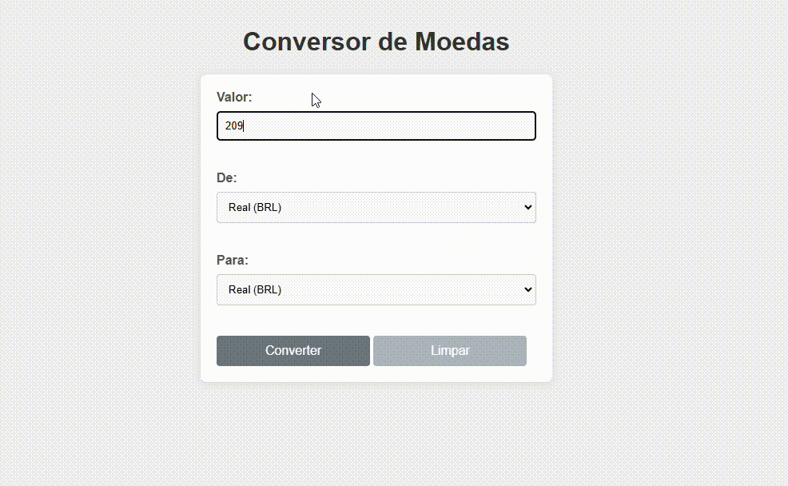

<h1 align="center" span style="color:#555">CONVERSOR DE MOEDAS 🚀</h1>

### Este projeto é um conversor de moedas, ele permite converter valores entre três moedas: Real (BRL), Dólar (USD) e Euro (EUR), utilizando taxas de câmbio fixas no código. Para usá-lo, o usuário insere o valor que deseja converter, seleciona a moeda de origem e a moeda de destino, e o conversor exibe o valor convertido automaticamente com base nas taxas estabelecidas. É uma ferramenta simples e prática para simular conversões de moedas diretamente no navegador.

<h1 align="center" span style="color:#555">ESTRUTURA DO PROJETO</h1>

### A estrutura HTML é composta por um formulário onde o usuário insere o valor, seleciona a moeda de origem e a moeda de destino, e então clica em "Converter" para realizar a conversão. Além disso, há um botão "Limpar" para resetar o formulário.

<h1 align="center" span style="color:#555">TECNOLOGIAS UTILIZADAS💻</h1>

* #### HTML
* #### CSS
* #### JavaScript
* ####  Para adaptar o conversor para novas moedas ou taxas de câmbio, basta adicionar ou atualizar os valores no objeto 

<h1 align="center" span style="color:#555">AUTORES🖊️</h1>

# Autora

[Maria Yanagui](https://github.com/MariaYanagui)

# Colaborador 
[Guilherme Serafim](https://github.com/Guilimas2)

